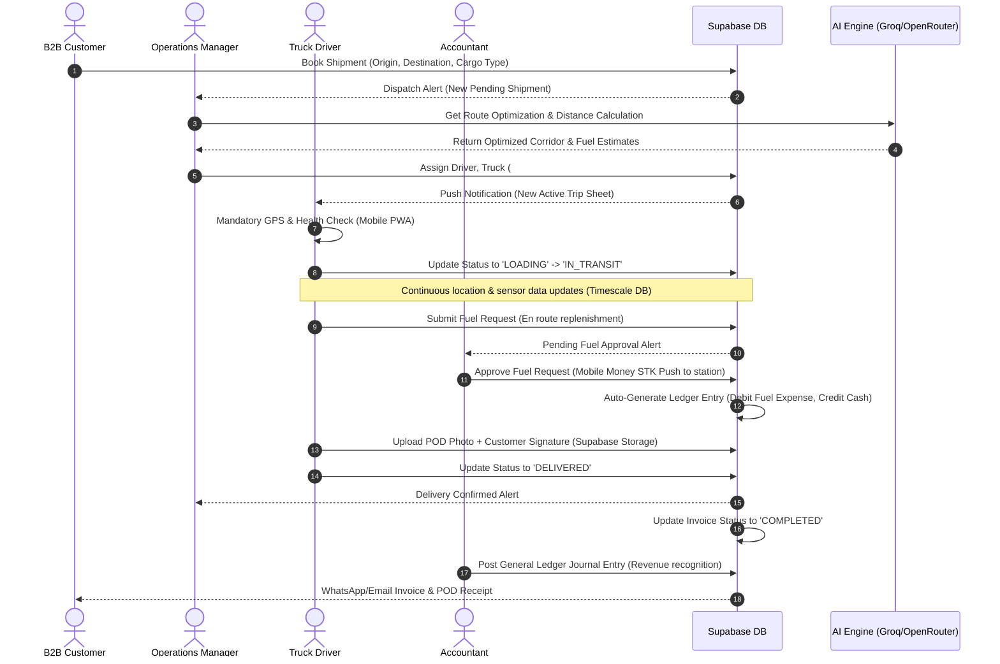
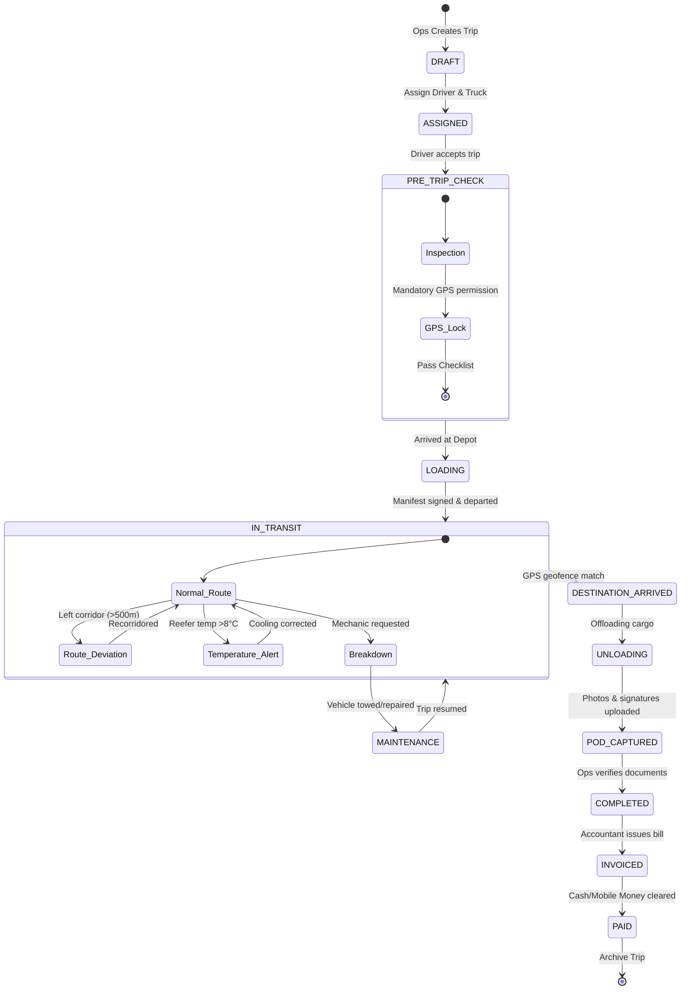
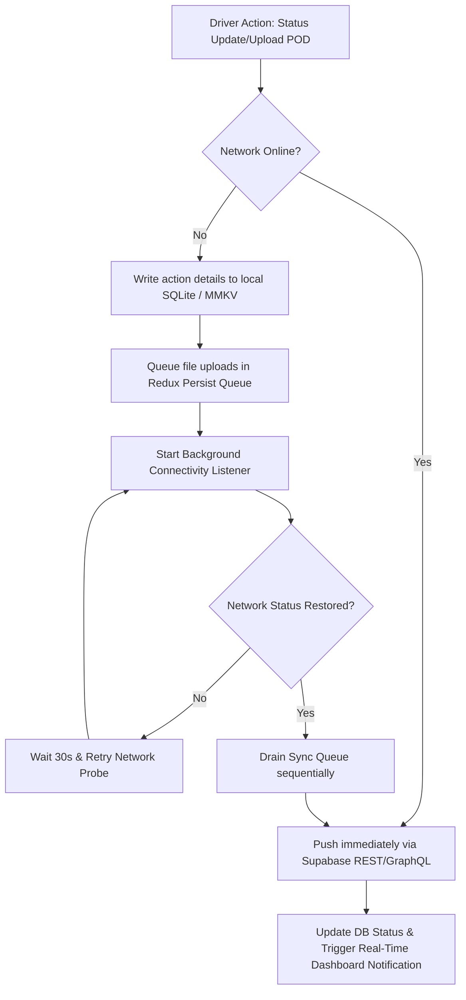

# Calvary Connect (Logistics OS) — Workflows & Env Blueprint
### Strategic Logistics Management & Digital Operations Reference Manual

---

## Executive Summary & System Philosophy

**Calvary Connect (Logistics OS)** is an enterprise-grade logistics and fleet operating system designed specifically for **Calvary Investment Company Ltd** (operating across Tanzania, Kenya, Uganda, Rwanda, Zambia, DRC, and SADC corridors). The platform coordinates fleet tracking, driver operations, maintenance scheduling, B2B customer portals, and double-entry financial accounting.

The system relies on a unified core stack:
* **Frontend**: Next.js 14 (App Router) + TypeScript + Tailwind CSS (desktop operations and mobile PWA driver sheets).
* **Backend**: Supabase (PostgreSQL 15, Supabase Auth, Row Level Security, Realtime Subscriptions).
* **Intelligence**: Multi-LLM provider orchestration (Groq, OpenRouter, Gemini) for predictive analytics, route optimization, and executive insights.
* **Storage**: Supabase Storage + AWS S3 Storage API with Iceberg catalog integrations for high-performance telemetry storage.

---

## 1. System-Wide Core Workflows

The following diagrams and walkthroughs explain how data moves through Calvary Connect to bridge real-world physical logistics with digital ledgers.

### 1.1 End-to-End Shipment & Accounting Pipeline

This workflow shows the complete lifecycle of a logistical order: from customer booking, driver tracking, fuel approval, to final financial reconciliation in the general ledger.



---

### 1.2 Detail: Trip Status & Fleet Lifecycle State Machine

This state machine details how vehicles and trips shift states synchronously. When a driver acts, the fleet tracker reflects it instantly via `onSnapshot` real-time listeners.



---

### 1.3 Detail: Double-Entry Bookkeeping Ledger Flow

Every single logistical event in Calvary Connect triggers a corresponding transaction in the Chart of Accounts to ensure cash flows, revenues, and expenses reconcile automatically.

```mermaid
graph TD
    %% Events
    E1[Driver Fuel Request Approved] --> T1{System Auto-Journal}
    E2[Customer Pays Local Invoice] --> T2{System Auto-Journal}
    E3[Driver Allowance Paid] --> T3{System Auto-Journal}

    %% Chart of Accounts Nodes
    A1000[1000 - Petty Cash / Bank]
    A1200[1200 - Accounts Receivable]
    A5020[5020 - Fuel & Lubricants Expense]
    A5050[5050 - Driver Allowance Expense]
    A4000[4000 - Freight Service Revenue]
    A2100[2100 - VAT Payable (18%)]

    %% Transaction 1
    T1 -->|Debit| A5020
    T1 -->|Credit| A1000
    style A5020 fill:#fcd34d,stroke:#333,stroke-width:1px
    style A1000 fill:#93c5fd,stroke:#333,stroke-width:1px

    %% Transaction 2
    T2 -->|Debit| A1000
    T2 -->|Credit| A1200
    T2 -->|Credit| A2100
    style A1200 fill:#fca5a5,stroke:#333,stroke-width:1px
    style A2100 fill:#fca5a5,stroke:#333,stroke-width:1px

    %% Transaction 3
    T3 -->|Debit| A5050
    T3 -->|Credit| A1000
    style A5050 fill:#fcd34d,stroke:#333,stroke-width:1px
```

> [!NOTE]
> **VAT Accounting**: 
> * **Local Trips** (domestic distribution in Tanzania) auto-calculate and record an **18% VAT Liability** to Account 2100.
> * **Transit Trips** (cross-border to Rwanda, Kenya, etc.) are structured with a **0% VAT Rate** (VAT Exempt), mapping the total sales directly to Account 4000.

---

### 1.4 Detail: Offline-First Driver App Synchronization

Drivers operate across vast swathes of remote Central Africa where networks are highly intermittent. The driver interface operates on an offline-first sync pipeline.



---

## 2. Comprehensive Environment Variables Blueprint (`.env`)

To configure Calvary Connect properly, all services must have access to specific keys. These variables are split into core groups:

1. **Supabase Core** (Database, Auth, realtime engine)
2. **AI & Intelligence Engine** (OpenRouter, Groq, Gemini)
3. **Map & Logistics Services** (Google Maps Platform)
4. **S3 object & Data Lake Telemetry storage** (Direct S3 Splicing)

### 2.1 Complete `.env` Master Template

This is the combined master config. Create a file named `.env` in the root directory:

```env
# ==============================================================================
#                 CALVARY CONNECT (LOGISTICS OS) Master Configuration
# ==============================================================================

# ------------------------------------------------------------------------------
# 1. Supabase Backend Core Settings
# ------------------------------------------------------------------------------
# The API endpoint URL for your Supabase project (from Settings > API)
NEXT_PUBLIC_SUPABASE_URL=https://your-project-id.supabase.co

# Client-safe anonymous API key. Restricted by database Row-Level Security (RLS).
NEXT_PUBLIC_SUPABASE_ANON_KEY=eyJhbGciOiJIUzI1NiIsInR5cCI6IkpXVCJ9.your_supabase_anon_key_placeholder

# Secret backend key. Bypasses all RLS policies. NEVER expose to the frontend.
SUPABASE_SERVICE_ROLE_KEY=eyJhbGciOiJIUzI1NiIsInR5cCI6IkpXVCJ9.your_supabase_service_role_key_placeholder

# ------------------------------------------------------------------------------
# 2. Maps & Logistical Route Processing
# ------------------------------------------------------------------------------
# API Key for Google Maps SDK. Handles autocomplete, distance matrix & route visualizers.
NEXT_PUBLIC_GOOGLE_MAPS_API_KEY=AIzaSyYourPlaceholderGoogleMapsKeyHere

# ------------------------------------------------------------------------------
# 3. AI & Engine Configuration (Orchestrated by Route & Data Analytics)
# ------------------------------------------------------------------------------
# Core Google Gemini Key used for Genkit and server-side semantic analytical reasoning.
GEMINI_API_KEY=AIzaSyYourPlaceholderGeminiKeyHere

# Groq Cloud API Key for rapid structural telemetry analysis (e.g. LLaMA model inference)
GROQ_API_KEY=gsk_your_placeholder_groq_key_here
NEXT_PUBLIC_GROQ_API_KEY=gsk_your_placeholder_groq_key_here

# OpenRouter configuration for cost-efficient free tier fallback routing (e.g. Minimax, Nemotron)
NEXT_PUBLIC_OPENROUTER_API_KEY=sk-or-v1-your_placeholder_openrouter_key_here
NEXT_PUBLIC_OPENROUTER_BASE_URL=https://openrouter.ai/api
NEXT_PUBLIC_OPENROUTER_MODEL=minimax/minimax-m2.5:free

# Nvidia NIM inference API keys for offline agent processing and logical evaluation
NEXT_PUBLIC_NVIDIA_API_KEY=sk-or-v1-your_placeholder_nvidia_key_here
NEXT_PUBLIC_NVIDIA_MODEL=nvidia/nemotron-3-nano-omni-30b-a3b-reasoning:free
```

---

### 2.2 Telemetry & Storage S3 Configuration (`.env.storage`)

For high-speed analytical ingestion and archiving sensory telemetry records, the system binds directly to Supabase's S3 wrapper and structured Apache Iceberg Data Warehouses. 

Create a file named `.env.storage` in the root:

```env
# ==============================================================================
#            CALVARY CONNECT (LOGISTICS OS) S3 & Telemetry Data Lake
# ==============================================================================

# 1. Supabase Storage S3 Interface Credentials
# Used to bypass standard HTTP endpoints in favor of high-throughput multi-part S3 uploads
S3_ACCESS_KEY_ID=your_s3_access_key_placeholder
S3_SECRET_ACCESS_KEY=your_s3_secret_key_placeholder
S3_ENDPOINT=https://your-project-id.storage.supabase.co/storage/v1/s3

# 2. AWS Analytics & Telemetry Processing Credentials
# Credentials mapping directly to sensory telemetry pipes (TimescaleDB / S3 bucket archiving)
AWS_ACCESS_KEY_ID=your_aws_access_key_placeholder
AWS_SECRET_ACCESS_KEY=your_aws_secret_key_placeholder

# 3. Iceberg Analytics Catalog & Data Warehouse configuration
TOKEN=sb_secret_your_token_placeholder
WAREHOUSE=calvaryconnect
CATALOG_URI=https://your-project-id.storage.supabase.co/storage/v1/iceberg
```

---

### 2.3 Environmental Profiles Matrix

The following table serves as an architectural blueprint of where each environment variable is processed:

| Variable Name | Client Exposure | Server Exposure | Critical Function | Setup Location |
| :--- | :--- | :--- | :--- | :--- |
| `NEXT_PUBLIC_SUPABASE_URL` | Yes | Yes | Establishes the base gateway connection for Auth, REST, and Realtime | Settings > API |
| `NEXT_PUBLIC_SUPABASE_ANON_KEY` | Yes | Yes | Authenticates safe client queries; strictly bound to Row Level Security | Settings > API |
| `SUPABASE_SERVICE_ROLE_KEY` | **No** | Yes | Runs administrative functions; bypasses all database RLS checks | Settings > API |
| `NEXT_PUBLIC_GOOGLE_MAPS_API_KEY` | Yes | Yes | Embeds dynamic tracking maps and parses route waypoints | Google Cloud Console |
| `GEMINI_API_KEY` | **No** | Yes | Orchestrates Genkit AI flows for semantic analytical logic | Google AI Studio |
| `GROQ_API_KEY` | **No** | Yes | Triggers rapid server-side data extraction and telemetry summarization | Groq Cloud Console |
| `NEXT_PUBLIC_OPENROUTER_API_KEY` | Yes | Yes | Powers the free tier LLM dispatcher fallback routing | OpenRouter Console |
| `S3_ACCESS_KEY_ID` | **No** | Yes | Facilitates S3 multipart programmatic uploads of POD files | Supabase Storage Settings |
| `TOKEN` | **No** | Yes | Authenticates Apache Iceberg catalog ingestion | Warehouse Settings |

---

## 3. Best Practices & Security Guidelines

> [!WARNING]
> **Credential Exposure Warning**:
> Under no circumstances should `SUPABASE_SERVICE_ROLE_KEY`, `S3_SECRET_ACCESS_KEY`, `AWS_SECRET_ACCESS_KEY`, or `GEMINI_API_KEY` be bundled or exposed to frontend components (i.e. files starting with `'use client'`). Always restrict these variables to API routes (`src/app/api/`) or Next.js Server Actions.

### 3.1 Git Protection
Ensure the root `.gitignore` blocks deployment and version control tracking of active `.env` files:
```git
# .gitignore
.env
.env.local
.env.storage
.env.production
```

### 3.2 Dynamic Fallbacks in Code
To avoid application crashes when keys are missing in secondary environments (e.g. preview channels), ensure variables are loaded with structured safe fallbacks in your codebase:

```typescript
// Example from src/lib/supabaseClient.ts
const supabaseUrl = process.env.NEXT_PUBLIC_SUPABASE_URL;
const supabaseAnonKey = process.env.NEXT_PUBLIC_SUPABASE_ANON_KEY;

if (!supabaseUrl || !supabaseAnonKey) {
  console.warn("⚠️ Supabase environment variables are missing! Falling back to offline mock mode.");
}

export const supabase = createClient(
  supabaseUrl || 'https://fallback-project.supabase.co', 
  supabaseAnonKey || 'fallback-key'
);
```
